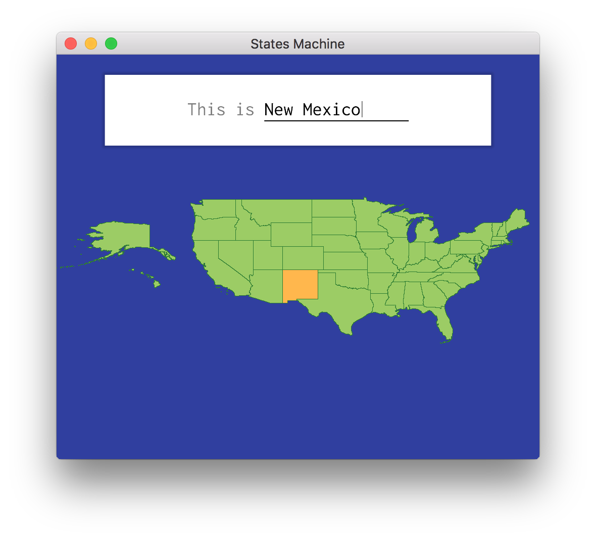

# States Machine
**States Machine** is an app to memorize the names and locations of the fifty US states
using [spaced repetition](https://en.wikipedia.org/wiki/Spaced_repetition).



## Aesthetics
- Smooth vector graphics, using real [US Census Bureau shapefiles](https://www.census.gov/geographies/mapping-files/time-series/geo/carto-boundary-file.html)
- UI inspired by [Material Design](https://material.io/design/), using [Inconsolata](https://fonts.google.com/specimen/Inconsolata) for text
- Starts up in less than one second
- Deployed as a single static binary, about 1.1 MB zipped

## Foundations
- Uses OpenGL 3.3 for graphics
  - Windowing: [GLFW](https://www.glfw.org/)
  - OpenGL loading: [GLEW](http://glew.sourceforge.net/)
  - Font rendering: [stb_truetype.h](https://github.com/nothings/stb/blob/master/stb_truetype.h)
- Uses an [SQLite](https://www.sqlite.org/index.html) database to store progress
- Written almost entirely in austere C

# Platforms
Setting expectations up front,
**States Machine** is mostly for me,
so I won't be making any major effort to make it
run on machines other than my own.
If you'd like to run it on (hypothetically speaking)
Arch Linux or OpenBSD,
you're entirely welcome,
but you'll have to do most of the legwork.

| OS           | Compiler                 | Maintainer                             | Notes                            |
| -            | -                        | -                                      | -                                |
| MacOS        | `llvm`                   | [@mkeeter](https://github.com/mkeeter) | Main development platform        |
| Windows      | `x86_64-w64-mingw32-gcc` | Not officially supported               | Compiles, but doesn't quite work |
| Your OS here | `???`                    | Your username here                     | Contributors welcome!            |

Other platforms will be supported if implemented and maintained by other contributors.

To become a platform maintainer, open a PR which:
- Implements a new platform
- Add details to the table above
- Updates the **Compiling** instructions below.

# Compiling
At the moment, **States Machine** supports compiling a native application on my laptop (MacOS 10.13).

It can cross-compile to Windows (if `TARGET=win32-cross` is set),
but the graphics don't completely work in Wine;
it's unknown whether it would work on a native Windows installation.

## Building dependencies
GLFW is shipped in the repository, to easily build a static binary.  It only needs to be compiled once.
```
[env TARGET=win32-cross] make glfw
```

## Building
```
[env TARGET=win32-cross] make
```

## Deploying an application bundle
### MacOS
[`cd deploy/darwin && deploy.sh`](https://github.com/mkeeter/states-machine/blob/master/deploy/darwin/deploy.sh)

Note that this does not sign / notarize / apostille the application bundle.
