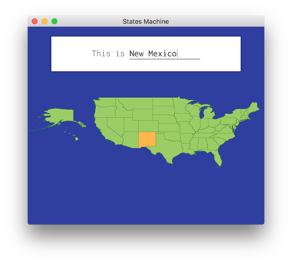

# States Machine
**States Machine** is an app to memorize the names and locations of the fifty US states
using [spaced repetition](https://en.wikipedia.org/wiki/Spaced_repetition).



## Aesthetics
- Smooth vector graphics, using real [US Census Bureau shapefiles](https://www.census.gov/geographies/mapping-files/time-series/geo/carto-boundary-file.html)
- UI inspired by [Material Design](https://material.io/design/), using [Inconsolata](https://fonts.google.com/specimen/Inconsolata) for text
- Starts up in less than one second
- Deployed as a single static binary, about 1.1 MB zipped

## Foundations
- Uses OpenGL 3.3 for graphics
  - Windowing: [GLFW](https://www.glfw.org/)
  - OpenGL loading: [GLEW](http://glew.sourceforge.net/)
  - Font rendering: [stb_truetype.h](https://github.com/nothings/stb/blob/master/stb_truetype.h)
- Uses an [SQLite](https://www.sqlite.org/index.html) database to store progress
- Implements the [SM2 algorithm](https://www.supermemo.com/en/archives1990-2015/english/ol/sm2) to plan repetitions
- Written almost entirely in austere C

# Platforms
Setting expectations up front,
**States Machine** is mostly [for me](https://www.robinsloan.com/notes/home-cooked-app/),
so I won't be making any major effort to make it
run on machines other than my own.

If you'd like to run it on (hypothetically speaking)
Arch Linux or OpenBSD,
you're entirely welcome,
but you'll have to do most of the legwork.

| OS           | Compiler                 | Maintainer                             | Notes                            |
| -            | -                        | -                                      | -                                |
| macOS        | `llvm`                   | [@mkeeter](https://github.com/mkeeter) | Main development platform        |
| Windows      | `x86_64-w64-mingw32-gcc` | Not officially supported               | Compiles, runs with graphical glitches |
| Your OS here | `???`                    | Your username here                     | Contributors welcome!            |

Other platforms will be supported if implemented and maintained by other contributors.

To become a platform maintainer, open a PR which:
- Implements a new platform
- Add details to the table above
- Updates the **Compiling** instructions below.

# Compiling
At the moment, **States Machine** supports compiling a native application on my laptop (MacOS 10.13).

It can also cross-compile to Windows (if `TARGET=win32-cross` is set),
with slight graphical glitches during window resizing.

## Building dependencies
GLFW is shipped in the repository, to easily build a static binary.  It only needs to be compiled once.
```
[env TARGET=win32-cross] make glfw
```

## Building
```
[env TARGET=win32-cross] make
```

## Deploying an application bundle
```
[env TARGET=win32-cross] make deploy
```
which executes [`deploy/darwin/deploy.sh`](https://github.com/mkeeter/states-machine/blob/master/deploy/darwin/deploy.sh)
(Mac) or
[`deploy/win32/deploy.sh`](https://github.com/mkeeter/states-machine/blob/master/deploy/win32/deploy.sh) (cross-compiling to Windows).

This command
produces the disk image `States Machine.dmg` (macOS)
or the zip archive `States Machine.zip` (Windows).

Note that this does not sign / notarize / apostille the application bundle.

# License
© 2019-2020 Matthew Keeter  
**States Machine** is released under the [MPL 2.0 license](https://www.mozilla.org/en-US/MPL/2.0/)

## Third-party software and data
**States Machine** includes the following libraries and data:
- GLEW: [Modified BSD license](https://github.com/mkeeter/states-machine/blob/master/vendor/glew/LICENSE.txt)
- GLFW: [zlib/libpng license](https://github.com/mkeeter/states-machine/blob/master/vendor/glfw/LICENSE.md)
- SQLite: [Public domain](https://www.sqlite.org/copyright.html)
- `stb_truetype.h`: [MIT / public domain](https://github.com/mkeeter/states-machine/blob/master/vendor/stb/stb_truetype.h#L4975-L5009)
- Inconsolata font: [Open Font License](http://scripts.sil.org/cms/scripts/page.php?site_id=nrsi&id=OFL_web)
